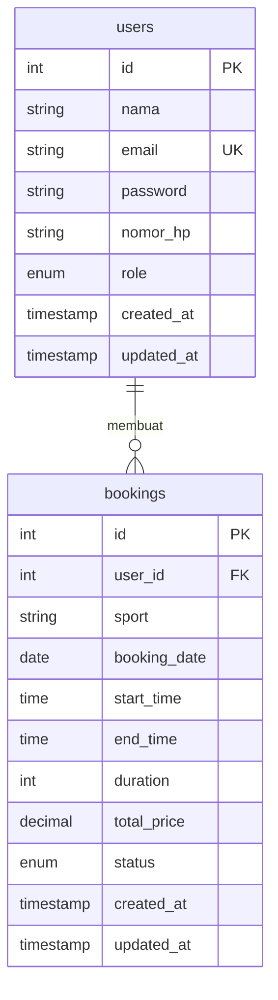

# GOR Booking Management System (MVP)

Sistem Informasi Manajemen Reservasi Lapangan GOR Arena (Multi-fungsi: Futsal, Badminton, Basket, Volley) berbasis web monolitik dengan arsitektur MVC (Model-View-Controller).

Aplikasi ini dikemas menggunakan Docker Compose agar mudah dideploy dalam lingkungan pengembangan maupun produksi.

---

## Fitur Utama MVP

1. **Autentikasi Pengguna**: Login & Registrasi pelanggan, login Administrator menggunakan JSON Web Token (JWT) dan enkripsi kata sandi `bcrypt`.
2. **Visualisasi Ketersediaan Lapangan**: Jadwal interaktif berbentuk timeline waktu 08:00 - 22:00 secara *real-time* (tersedia = hijau, terisi = merah).
3. **Pemesanan Lapangan (Booking)**: Form interaktif terhitung otomatis berdasarkan durasi per jam, dengan pencegahan bentrok/tumpang tindih jadwal secara *real-time*.
4. **Dashboard Pelanggan**: Statistik pemesanan pribadi, ringkasan booking terdekat yang aktif, riwayat lengkap, dan edit profil.
5. **Dashboard Administrator**: Statistik ringkasan (Total Users, Bookings Today, Bookings Week/Month), verifikasi persetujuan (Approve, Cancel, Complete) status booking, dan daftar database pengguna terdaftar.
6. **Desain Premium**: Tampilan *Dark Mode* modern, komponen *glassmorphism*, aksen warna neon emerald, dan desain responsif (ponsel, tablet, desktop).

---

## Spesifikasi Teknologi

* **Frontend**: HTML5, CSS3 (Vanilla), JavaScript ES6 (Vanilla, fetch API), Font Awesome 6.
* **Backend**: Node.js, Express.js (REST API, MVC Architecture).
* **Database**: MySQL 8.
* **Kontainerisasi**: Docker & Docker Compose.

---

## Entity Relationship Diagram (ERD)



---

## Dokumentasi API (REST API)

### 1. Autentikasi (`/api/auth`)
* `POST /register`: Mendaftarkan customer baru (Field: `nama`, `email`, `nomor_hp`, `password`).
* `POST /login`: Masuk ke sistem (Field: `email`, `password`). Mengembalikan JWT Token dan informasi User.
* `GET /profile`: Mengambil detail profil user yang sedang login (Protected).
* `PUT /profile`: Memperbarui data profil & password (Protected).
* `GET /users`: Mengambil daftar pengguna terdaftar (Protected - Admin Only).

### 2. Pemesanan Lapangan (`/api/bookings`)
* `GET /schedule?date=YYYY-MM-DD`: Mengambil daftar jam ketersediaan lapangan pada tanggal tertentu (Public).
* `POST /`: Membuat pengajuan booking lapangan baru (Protected - Customer Only, Field: `sport`, `booking_date`, `start_time`, `duration`).
* `GET /my`: Mengambil riwayat booking pribadi milik customer (Protected - Customer Only).
* `GET /`: Mengambil semua daftar booking (Protected - Admin Only, opsi filter `?date=YYYY-MM-DD`).
* `PUT /:id/status`: Mengubah status pemesanan (`approved`, `cancelled`, `completed`) (Protected - Admin Only).

### 3. Dashboard (`/api/dashboard`)
* `GET /customer`: Mengambil metrik ringkasan untuk dashboard customer (Protected - Customer Only).
* `GET /admin`: Mengambil statistik ringkasan dashboard admin (Protected - Admin Only).

---

## Cara Menjalankan Aplikasi

Pastikan Anda sudah menginstal **Docker** dan **Docker Compose** di komputer Anda.

### Langkah-langkah:

1. Clone atau letakkan folder proyek ini di direktori lokal Anda.
2. Salin konfigurasi environment variable dari `.env.example` ke `.env`:
   ```bash
   cp .env.example .env
   ```
3. Jalankan perintah Docker Compose untuk membangun dan menjalankan kontainer:
   ```bash
   docker compose up --build
   ```
4. Tunggu beberapa saat hingga database MySQL siap menerima koneksi (ditandai dengan log `Database verified active` pada container `gor-app`).
5. Akses aplikasi melalui browser di alamat:
   **[http://localhost:3000](http://localhost:3000)**

---

## Akun Pengguna Bawaan (Default Seeding)

Saat aplikasi pertama kali dijalankan, sistem akan otomatis melakukan *seeding* akun administrator ke dalam database:

* **Akun Administrator**:
  * Email: `admin@gor.com`
  * Sandi: `admin123`
  * Peran: `admin`

Untuk masuk sebagai **Customer (Pelanggan)**, Anda dapat mendaftar secara mandiri melalui tombol **Daftar Akun** di pojok kanan atas halaman beranda.
